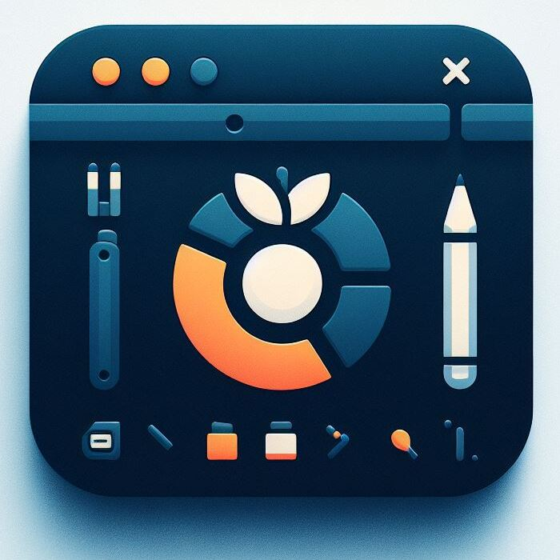

# MyTerm

This repository is a (really) small side project that I tried playing with. My goals with this project was to build a client application, use Rust as a language for a concrete project and try out Tauri's developing / deployment process.

## Prerequisites

The prerequisites for this project are equivalent to the Tauri prerequisites:
https://tauri.app/v1/guides/getting-started/prerequisites

Follow the instructions here and it should setup you up for this project as well.

## Use

Go to the release page for this repository and download the executable for your platform.
